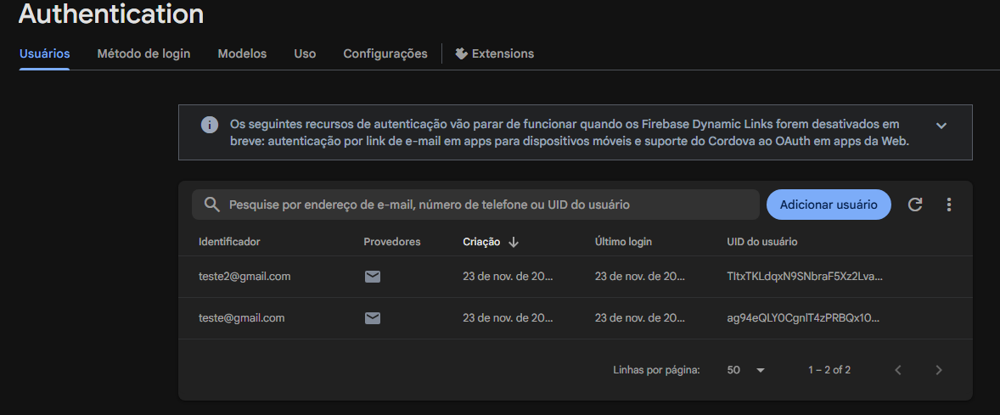
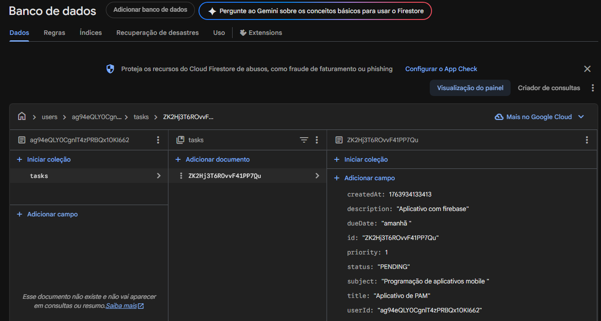

# 📚 StudyTask -- Aplicativo de Gestão de Estudos

Aplicativo Android desenvolvido em **Kotlin + Jetpack Compose**,
utilizando **Firebase Authentication** para login e **Cloud Firestore**
para armazenamento de tarefas organizadas por usuário.

O sistema possui:

✔️ Tela de Login e Registro\
✔️ Tela Home com lista de tarefas\
✔️ CRUD completo (Criar, Ler, Atualizar e Deletar tarefas)\
✔️ Organização das tasks por usuário no Firestore (`users/{uid}/tasks`)\
✔️ Navegação com Navigation Compose\
✔️ Arquitetura desacoplada com ViewModels + Repository\
✔️ Regras seguras do Firestore\
✔️ Telas estilizadas com Material 3

------------------------------------------------------------------------

# 📸 Demonstração do App

> Adicione aqui seus prints reais:

-   Tela de Login\
 18.26.59_56a4c23b.jpg>)
-   Tela Home\
 18.27.00_892a38fd.jpg>)
-   Tela de Nova/Editar Tarefa\
 18.27.00_eb354c13.jpg>)
-   Print do Firestore mostrando `users/{uid}/tasks`


------------------------------------------------------------------------

# 🛠️ Tecnologias Utilizadas

### **Frontend**

-   Kotlin
-   Jetpack Compose
-   Material Design 3
-   Navigation Compose
-   ViewModel + State Hoisting

### **Backend**

-   Firebase Authentication
-   Firebase Firestore
-   Firebase BoM


------------------------------------------------------------------------

# 📂 Estrutura do Projeto

    app/
    └── src/main/java/com/example/studytask/
        ├── MainActivity.kt
        ├── navigation/
        │   └── AppNavHost.kt
        ├── data/
        │   ├── auth/
        │   │   └── AuthRepository.kt
        │   ├── model/
        │   │   └── Task.kt
        │   └── task/
        │       └── TaskRepository.kt
        └── ui/
            └── screens/
                ├── LoginScreen.kt
                ├── HomeScreen.kt
                └── TaskFormScreen.kt

------------------------------------------------------------------------

# 🔐 Regras do Firestore (Security Rules)

O app usa subcoleções organizadas por usuário:

    users/{uid}/tasks/{taskId}

Regras:

``` txt
rules_version = '2';
service cloud.firestore {
  match /databases/{database}/documents {

    match /users/{userId}/tasks/{taskId} {
      allow read, write: if request.auth != null
                         && request.auth.uid == userId;
    }
  }
}
```

Essas regras garantem:

✔ Cada usuário só vê suas próprias tarefas\
✔ Cada task pertence a apenas um usuário\
✔ Escreve e lê apenas se estiver autenticado

------------------------------------------------------------------------

# 🚀 Funcionalidades

### ✔ Login & Registro

-   Autenticação com email e senha\
-   Validações\
-   Feedback visual

### ✔ Tela Inicial (Home)

-   Lista de tarefas do usuário logado\
-   Botão para adicionar novas tarefas\
-   Ação de logout\
-   Botão para excluir tarefas\
-   Navegação para editar tarefa

### ✔ CRUD completo

-   Criar tarefa\
-   Editar tarefa\
-   Excluir tarefa\
-   Listar tarefas\
-   Salvar no Firestore por usuário

### ✔ Firestore estruturado por usuário

    users/
       └── uid123/
            └── tasks/
                  ├── id1
                  ├── id2


